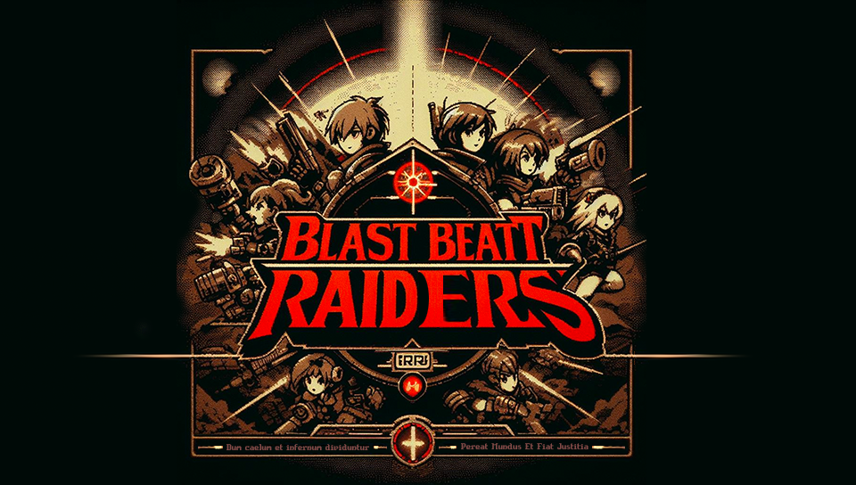

# BlastBEATT Raiders

*" —Whilst heaven and hell remain divided // Let the world perish and justice be done —"* 

---

## About
**BlastBEATT Raiders** is a dungeon crawler RPG for homebrew-enabled **Playstation Vita** consoles. It features design elements based off of the Game Boy Advance-era [Sting Entertainment (株式会社スティング)](https://en.wikipedia.org/wiki/Sting_Entertainment) titles, primarily [Rivera: The Promised Land](https://en.wikipedia.org/wiki/Riviera:_The_Promised_Land).

The project is intended to be a personal love letter to the studio's NTSC-localized games, and an excuse to *~~torture myself with~~* finally learn C++.

## Story Synopsis (tbd)
The game is set in a post-apocalyptic world where the player must navigate through a series of dungeons to uncover the truth behind the world's destruction. The game features a unique combat system, a deep story, and retro-inspired graphics.

## Progress
So far I've got just a demo of the intro splash screens and main menu. The game is still in its early stages, but I'm working on it whenever I can.

## License
Thisn project is under a dual license of the GNU General Public License v3 (source code) and the CC BY 4.0 License (assets). See the appropriate `LICENSE` files for more information.

---

*As of current, this project does contain some AI generated assets. I will inevitably be working on replacing these with original assets. If you have any questions or concerns, or would like to contribute to eliminate these, please feel free to reach out to me.*